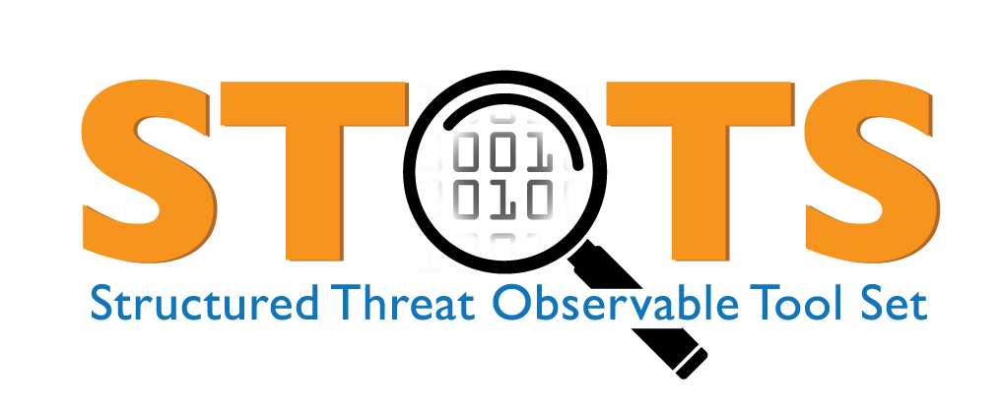
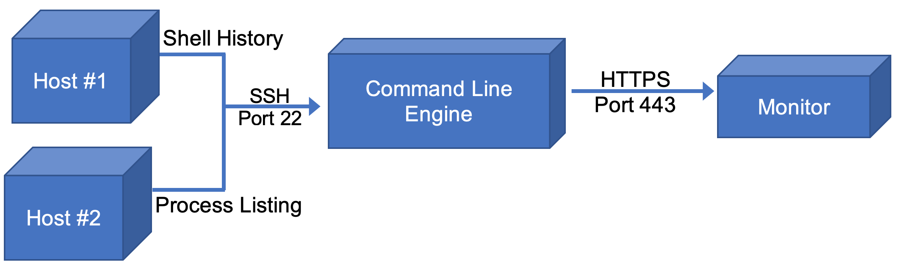
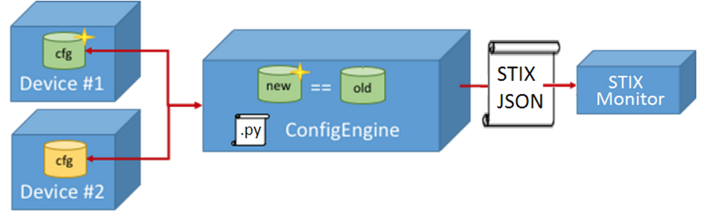
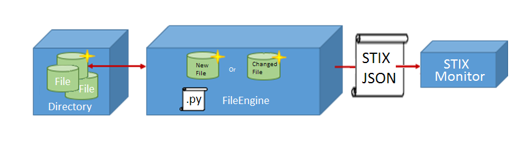
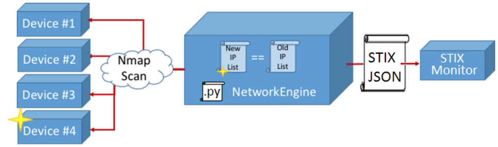
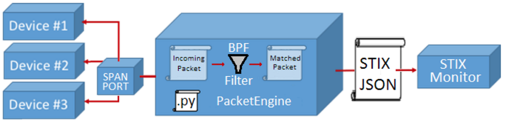
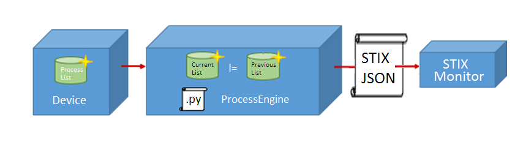

## Introduction
Structured Threat Observable Tool Set (STOTS) is a tool set, not an application, developed by Idaho National Laboratory (INL) as part of the California Energy Systems for the 21st Century (CES-21) project. STOTS uses Structured Threat Information Expression (STIX) as a method for detection and monitoring. These tools can be used by cyber personnel with familiarity of command line scripting to find Indicators of Compromise (IOCs) on configuration specific systems. The tools developed in STOTS focus on surgical detection and response for a specific threat, enabling cyber defenders to be more agile in defense against cyber adversaries. This provides an agnostic tool set which enables detection in the absence of, or in coordination with commercial-off-the-shelf (COTS) products.

See the [STOTS Innovation Sheet](19-50503_STOTS_Innovation_Sheet.pdf) for an overview.

The output of STOTS is a STIX v2 compliant Observed Data object. For more information on STIX see https://oasis-open.github.io/cti-documentation/stix/intro.html.


STOTS is a collection of the following tools written in Python 3:

- CommandLineEngine
- ConfigEngine
- FileEngine
- NetworkEngine
- ProcessEngine
- SyslogEngine
- PacketEngine

___

## Installation

STOTS requires Python 3.5.3 or greater. It is recommended to install all python packages in a Python virtual environment.  You can install the dependencies required for running STOTS with either of the following two processes detailed below: Setup.py or Requirements.txt.

### Python Environment
#### Linux
In a terminal, navigate to the requirements.txt file for the STOTS Engine.

To create and activate a virtual environment:
```
python3 -m venv <virtual_env_name>
source <virtual_env_name>/bin/activate
```

When you are done with this virtual environment, deactivate the virtual environment
`deactivate`

#### Windows
In a command prompt, navigate to the requirements.txt file for the STOTS Engine.

To create and activate a virtual environment:
```
python -m venv <virtual_env_name>
\<virtual_env_name>\Scripts\activate.bat
```

When you are done with this virtual environment, deactivate the virtual environment
`deactivate`

### Setup.py
From the project root directory or any single engine's directory, type (Linux): `python3 setup.py install`, or (Windows): `python setup.py install`

Note: PacketEngine also requires you to run the following two commands:
```bash
pip install -e git+https://github.com/oasis-open/cti-pattern-matcher.git@736453b1a32a2a1ba351bace33e6a4b1c409f2e1#egg=stix2_matcher
pip install -e git+https://github.com/oasis-open/cti-pattern-validator.git@5e0ff542c700c117baf1e8b1a9da934c263a034f#egg=stix2_patterns
```

### Requirements.txt
Requirements for individual STOTS Engines can be installed using the provided requirements.txt file in the respective engine folder.

#### Linux/Windows
In a terminal/command prompt, navigate to the requirements.txt file for the STOTS Engine.

To install python dependencies:

```
pip install -r requirements.txt
```
___
## CommandlineEngine

CommandlineEngine is a command line interface (CLI) program written to monitor commands executed on the command line (or on the shell) of a given system. To do this CommandlineEngine remotes into devices using SSH and either executes the 'ps' command to see currently running processes and their arguments, or reads the bash history for one or more users. The commands are processed into a unique set and compared against the previous set, differences are sent to the configured STIX Monitor as a formatted JSON observed data object payload.



### Usage
```
python3 CommandLineEngine.py [-h] [-S] [-F FILTER] [-d DELAY] [-p PORT] [-u USERNAME] [-P PASSWORD] IP STIX_MONITOR_IP:PORT MODE
```
Required Arguments:

- `IP` The IP address o the system to monitor.
- `STIX_MONITOR_IP:PORT` The network IP address and port (separated by a colon) of the STIX Monitor.
- `MODE` Whether the engine will use the process listing or bash history for monitoring, must be 'history' or 'process'

Optional Arguments:

- `-S` Turns on stream mode for constant, faster polling when using the 'process' mode, takes no arguments
- `-F` Takes a filter string, only commands containing the filter string will be registered
- `-d` Takes a positive float between 0 and 86400, this will be used as a delay between checks
- `-u` Username for the device to be monitored
- `-p` Password for the device to be monitored
- `-P` Port that will be used for ssh, defaults to 22

### Configuration

None

### Notes

CommandLineEngine is currently limited to monitoring Unix based systems only.
___

## ConfigEngine

ConfigEngine is a command line interface (CLI) program written to monitor the system configuration of a specific device.  This is achieved by running a custom written Telnet or SSH script to remotely login to the monitored device and download its current configuration to a local file.  This process is repeated after a configurable amount of time and the changes (if any) are compared.  If a change is identified, a STIX observable object is generated detailing the change and is transmitted to the STIX_MONITOR.



### Usage

```
python3 ConfigEngine.py [DEVICE_IP] [STIX_MONITOR_IP:PORT] [DELAY]
```

Required Arguments:

- `DEVICE_IP` The IP Address of the device that ConfigEngine will monitor
- `STIX_MONITOR_IP:PORT` The network IP address and port (separated by a colon) of the STIX Monitor
- `DELAY` The number of seconds to wait between attempts to remotely login and download the current device configuration (e.g. The time between one successful download and the start of the next attempt.  This does not include the actual login and download time.)

Optional Arguments:

- None

### Configuration

Custom scripts/functions will need to be written to meet individual user and device needs.  The only requirement for a custom script to obtain a device configuration is that the obtained config must be returned as a text string. See code comments.
___

## FileEngine

FileEngine is a command line interface (CLI) program written to monitor the files present in a chosen directory on a chosen system.  This is achieved by running remotely logging in to the chosen system and using an 'ls -la' or 'dir' command; saving the resulting list of files to a local file.  This process is repeated after a configurable amount of time and the changes (if any) are compared.  If a change is identified, a STIX observable object is generated detailing the change and is transmitted to the STIX_MONITOR.



### Usage

```
python3 FileEngine.py [DEVICE_IP] [STIX_MONITOR_IP:PORT] [PATH_TO_DIRECTORY] [-d DELAY] [-u USERNAME] [-p PASSWORD] [--os TARGET_OS]
```

Required Arguments:

- `DEVICE_IP` IP address of the device being monitored.
- `STIX_MONITOR_IP:PORT` The network IP address and port (separated by a colon) of the STIX Monitor.
- `PATH_TO_DIRECTORY` Destination path where files are being monitored.


Optional Arguments:

- `-d` The length of time in seconds that FileEngine should wait between subsequent file checks.
- `-u` Username for the monitored device.
- `-p` Password for the monitored device.
- `--os` Target operating system.  Default = Linux

### Configuration

None
___

## NetworkEngine

NetworkEngine is a command line interface (CLI) program written to monitor the nodes present on a particular subnet of a network.  This is achieved by running a simple NMAP scan on a network and saving the resulting list of nodes to a local file.  This process is repeated after a configurable amount of time and the changes (if any) are compared.  If a change is identified a STIX observable object is generated detailing the change and is transmitted to the STIX_MONITOR.



### Usage

```
python3 NetworkEngine.py [NETWORK_CIDR] [STIX_MONITOR_IP:PORT] [-d DELAY]
```

Required Arguments:
- `NETWORK_CIDR` The IP Address in CIDR notation of the network that NetworkEngine will monitor
- `STIX_MONITOR_IP:PORT` The network IP address and port (separated by a colon) of the STIX Monitor

Optional Arguments:
- `-d` The number of seconds to wait between NMAP scans and the saving of the currently connected nodes (e.g. The time between one successful scan and the start of the next scan.  This does not include the actual NMAP scan time.

### Configuration

None
___

## PacketEngine

PacketEngine is a command line interface (CLI) program written to monitor SPAN traffic on an Ethernet interface.  PacketEngine implements a BPF (Berkley Packet Filter) based filter for all packets.  When a packet is seen which matches the BPF filter the packet contents are bundled into a JSON/STIX Observable object and is transmitted to the STIX Monitor.



### Usage for Live Traffic Monitoring
```
python3 PacketEngine.py [-i ETHERNET_INTERFACE] [-f FILTER] [-t STIX_MONITOR_IP]  [-p STIX_MONITOR_PORT] [-c COUNT] [-o FILENAME] [--dump] [--debug] [--offline] [--bundle] [--patterns]
```

Required Arguments:
- `-i` The Ethernet interface/SPAN interface that PacketEngine will monitor
- `-t` The IP Address for the STIX Monitor where PacketEngine will send observable data objects
- `-p` The network port that the STIX Monitor is listening for observable data objects sent from PacketEngine

Optional Arguments:
- `-f` The filter used to reduce the amount of observed data objects that are created and sent to the STIX Monitor (e.g. 'port 23 and host 111.222.333.444')
- `-c` Total number of desired packets.
- `-o` Filename to write captured packets in pcap format, default is None.
- `--display_filter` Wireshark display filter for live capture (default=all packets)
- `--dump` Dump decoded packets to stdout only.
- `--debug` Enable DEBUG logging
- `--offline` Do not attempt to send data to STIX_MONITOR.
- `--bundle` Filename: Write a json bundle of all observed data objects to file.
- `--patterns` File containing stix2 patterns to match. Only packets matching                                            patterns will be sent.

### Usage for Offline Traffic Playback
```
python3 PacketEngine.py  [-r READ] [-f FILTER] [-t STIX_MONITOR_IP]  [-p STIX_MONITOR_PORT] [-d DIRECTORY] [-c COUNT] [-o FILENAME] [--dump] [--debug] [--offline] [--bundle] [--patterns]
```

Required Arguments:
- `-r` Read from PCAP file for file capture
- `-t` The IP Address for the STIX Monitor where PacketEngine will send observable data objects
- `-p` The network port that the STIX Monitor is listening for observable data objects sent from PacketEngine

Optional Arguments:
- `-d` PCAP directory to read multiple files
- `-c` Total number of desired packets.
- `-o` Filename to write captured packets in pcap format, default is None.
- `--dump` Dump decoded packets to stdout only.
- `--debug` Enable DEBUG logging
- `--offline` Do not attempt to send data to STIX_MONITOR.
- `--bundle` Filename: Write a json bundle of all observed data objects to file.
- `--patterns` File containing stix2 patterns to match. Only packets matching                                     patterns will be sent.

### Configuration
PacketEngine requires Tshark (Wireshark) to be installed. A SPAN port must be configured for the desired network for live network traffic.

#### Tshark installation
##### Linux
In a terminal window, type:
```
sudo apt-get update
sudo apt install tshark
```
##### Windows
See https://www.wireshark.org/download.html to download and install Wireshark.

## ProcessEngine

ProcessEngine is a command line interface (CLI) program written to monitor processes running on a desired system.  This is achieved by remotely accessing the desired system and utilizing the pgrep or tasklist command to determine if a selected process is running.  If a change in run status is identified, a STIX observable object is generated detailing the change and it is transmitted to the STIX_MONITOR.



### Usage
```
python3 ProcessEngine.py [DEVICE_IP] [STIX_MONITOR_IP:PORT] [-r RUNTIME] [-d DELAY] [-u USERNAME] [-p PASSWORD] [--os TARGET_OS] [-a ABSENCE_PRESENCE] [PROCESS_LIST]
```

Required Arguments:

- `DEVICE_IP` IP address of the monitored device.
- `STIX_MONITOR_IP:PORT` The IP Address and port for the STIX Monitor.
- `PROCESS_LIST` A comma separated list of process names to monitor.

Optional Arguments:

- `-r` The length of time in seconds that ProcessEngine should be active.  An input of '0' seconds will allow ProcessEngine to run continually
- `-d` The length of time in seconds that ProcessEngine should wait between subsequent process status checks
- `-u` Username for the monitored device.
- `-p` Password for the monitored device.
- `--os` Target operating system.  Default = Linux
- `-a` Checks for the absence (`a`) or presence (`p`) of a process. Default is `p`.

### Configuration

None

## SyslogEngine

SyslogEngine is a command line interface (CLI) program written to utilize Elastic's Filebeat to monitor Syslog entries on a specified device.  When a monitored Syslog is added, Filebeats is configured to package the change as a UDP packet and forward it to a Syslog Server which in turn is setup to listen for these UDP packets and send STIX Observable Data Objects to the STIX Monitor.


### Usage for Local SyslogEngine Component
Linux:
```
sudo python3 SyslogEngine.py [LOG_COLLECTOR:PORT] [STIX_MONITOR_IP:PORT]
```
Windows:
```
python SyslogEngine.py [LOG_COLLECTOR:PORT] [STIX_MONITOR_IP:PORT]
```
Required Arguments:

- `LOG_COLLECTOR_IP:PORT` The IP Address and port for the Syslog collector in which SyslogRemote.py forwards Syslog Entries.
- `STIX_MONITOR_IP:PORT` The IP Address and port for the STIX Monitor where SyslogEngine.py will send observable data objects.

Optional Arguments:
- None

### Usage for Remote SyslogEngine Component
```
python3 SyslogRemote.py [LOG_COLLECTOR_IP:PORT] [-p ROOT_PASSWORD]
```

Required Arguments:

- `LOG_COLLECTOR_IP:PORT` The IP Address and port for the Syslog collector in which SyslogRemote.py forwards Syslog Entries.

Optional Arguments:
- `-p` Root password of the remotely monitored machine.

### Configuration
SyslogEngine requires Filebeat and netcat (ncat or nc) to be installed on the remote device, if not already present. See https://www.elastic.co for Filebeat installation instructions and https://nmap.org/ncat/ for Netcat installation instructions. All desired Remote Monitors (SyslogRemote.py) and Syslog Servers (SyslogEngine.py) need to be running in order for changes to be sent to the STIX Monitor.

Filebeat needs to be configured to monitor a desired Syslog and output all changes to StdOut. Add the following to the Outputs section of filebeat.yml:
```
#----------------------------- Console output ------------------------
output.console:
  enabled: true
  codec.format:
    string: '%{[source]} %{[message]}'
```

### Notes
Syslog Engine (SyslogEngine.py) is intended to run as root from the same system as all other STOTS utilities. Filebeat Forwarders (SyslogRemote.py) are intended to be configured and run from the device containing the Syslogs of interest.

## Contributing
Pull requests are welcome. For major changes, please open an issue first to discuss what you would like to change.

## Licensing
See COPYRIGHT.txt and LICENSE.txt for copyright and licensing information.
